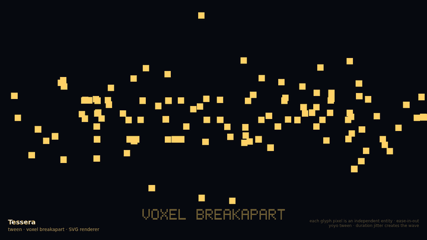

# Tessera

> _**TypeScript framework for layered 2D voxel scenes.**_

Pluggable renderer (SVG / Canvas2D / WebGL2). Dynamic entities. Page-citizenship defaults so a hero scene doesn't burn battery. Built to grow into a 2D game engine without rewriting userland code.



*"TESSERA" — every glyph pixel is an independent entity, animated via a per-cell `tween` that flies it radially outward and back. Live: [lpettay.github.io/tessera/#breakapart](https://lpettay.github.io/tessera/#breakapart).*

> **Status:** pre-alpha (v0). API will change. Don't depend on it yet.

---

## What it is

Tessera describes a 2D scene as **layered voxel grids** plus **dynamic entities**. The same scene description renders to:

- **SVG** — for accessible, page-embedded scenes (10s–100s of cells)
- **Canvas2D** — for medium-scale scenes (1k–10k cells)
- **WebGL2** — for game-scale scenes and GPU-resident particle simulation (10k–1M+ cells, particles up to ~1–2M)
- **WebGPU** *(planned)* — compute-shader particle sim, 1M+ at 60fps

A page-citizenship layer sits above all renderers — auto-pause when offscreen, throttle on battery saver, respect `prefers-reduced-motion`, frame-budget meter.

## Why

No existing library lets a voxel scene start as 30 SVG rects on a marketing page and grow into a million-particle GPU sim without rewriting userland. Pixi/Phaser are game engines that want to own the page; SVG/Canvas hand-rolls don't scale; sprite-stack helpers are technique demos, not frameworks.

Tessera fills that gap.

## Install

```bash
bun add tessera-engine
```

> Package: `tessera-engine`. Brand: Tessera. (Bare `tessera` on NPM is a long-running map tile server in an unrelated domain.)

## Live demos

The gallery hub at **[lpettay.github.io/tessera](https://lpettay.github.io/tessera/)** cycles through every demo (`←`/`→` to navigate, `1`–`6` to jump):

| Demo | URL |
|---|---|
| Mug — original `oscillate` + `spin` | [`/#mug`](https://lpettay.github.io/tessera/#mug) |
| Title menu — `pulse` / `bob` / `fade` / `drift` | [`/#menu`](https://lpettay.github.io/tessera/#menu) |
| Inventory — JRPG status screen | [`/#inventory`](https://lpettay.github.io/tessera/#inventory) |
| Landing — voxel marketing hero | [`/#landing`](https://lpettay.github.io/tessera/#landing) |
| Rhythm HUD — every animation kind in one frame | [`/#rhythm`](https://lpettay.github.io/tessera/#rhythm) |
| Breakapart — `tween` + per-cell decomposition | [`/#breakapart`](https://lpettay.github.io/tessera/#breakapart) |

## Quick start

```bash
bun add tessera-engine
```

```ts
import { svgRenderer, withPageCitizenship, type Scene } from "tessera-engine";

const scene: Scene = {
  layers: [{
    id: "main", cellSize: 12, width: 40, height: 20,
    zIndex: 0, opacity: 1, visible: true,
    entities: [{
      id: "hello",
      position: { x: 20, y: 10 },
      shape: { kind: "text", text: "HELLO", fill: "#ffd166", scale: 0.6 },
      animation: { kind: "pulse", from: 1, to: 1.1, durationMs: 1800, repeat: "infinite" },
    }],
  }],
};

const inner = svgRenderer.mount(document.getElementById("scene")!, scene);
const controller = withPageCitizenship(inner, document.getElementById("scene")!);
```

Scenes are pure data. Renderers consume them. The same `Scene` will run through Canvas2D and WebGL2 tiers as those ship.

## Architecture

```
┌─ Page-citizenship layer (universal) ─────────────────────────┐
│  IntersectionObserver pause · prefers-reduced-motion         │
│  battery/thermal hints · frame-budget meter                  │
├─ Renderer interface ─────────────────────────────────────────┤
│  Scene → Layer[] → Cell[] + Entity[] + ParticleSystem[]     │
├─ Tier 1: SVG ──┬─ Tier 2: Canvas2D ─┬─ Tier 3: WebGL2 ───────┤
│  <500 cells    │ 500–10k cells      │ 10k–1M cells           │
│  Page heroes   │ Prototypes         │ Particles, games       │
│  Accessible    │ No GPU needed      │ Universal mobile        │
└────────────────┴────────────────────┴─────────────────────────┘
                                          ↑ planned: Tier 4 WebGPU
```

See [`docs/architecture.md`](./docs/architecture.md) and the ADRs in [`docs/decisions/`](./docs/decisions/) for full design rationale.

## Repo layout

```
.
├── docs/                    Architecture, ADRs, embedded media
├── examples/                Live demo scenes (mug, menu, inventory, landing, rhythm, breakapart, gallery hub)
├── scripts/                 Repo-hygiene tooling (check, stamp, worktree)
├── src/                     Framework source (core types + SVG renderer + page citizenship)
├── AGENTS.md                Top-level agent instructions
├── CONTRIBUTING.md          PR + workflow conventions
└── README.md
```

## Contributing

See [`CONTRIBUTING.md`](./CONTRIBUTING.md). API surface is unstable until v0.1 — non-breaking PRs only until then.

## License

MIT — see [`LICENSE`](./LICENSE).
