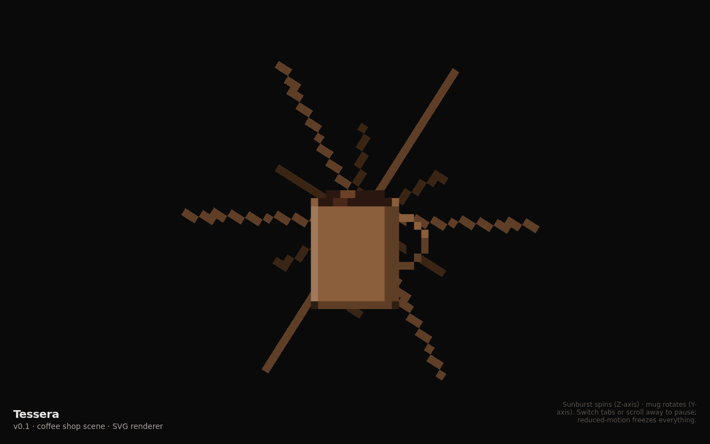
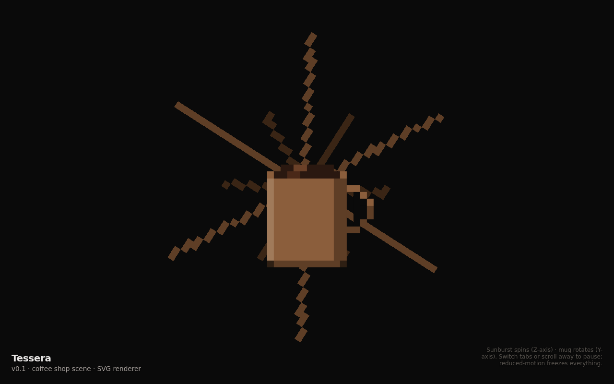
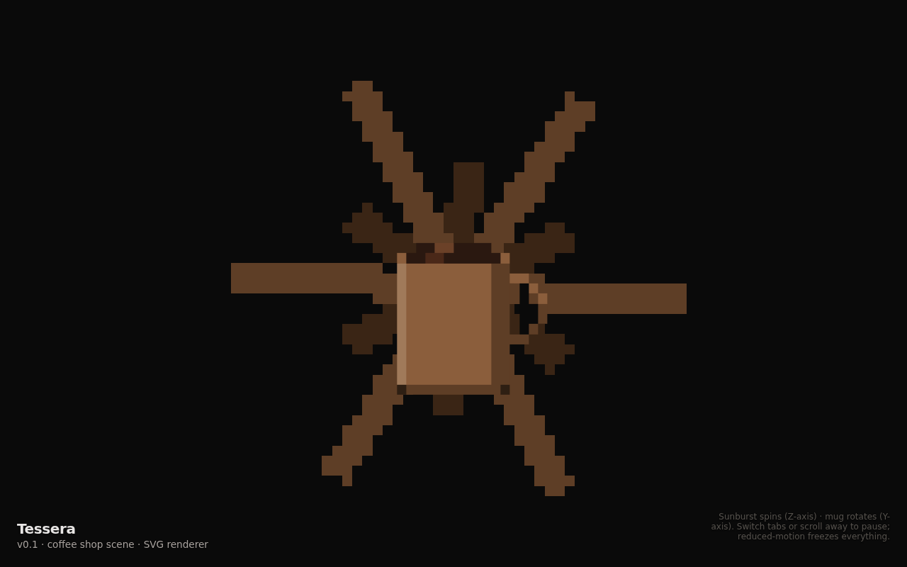
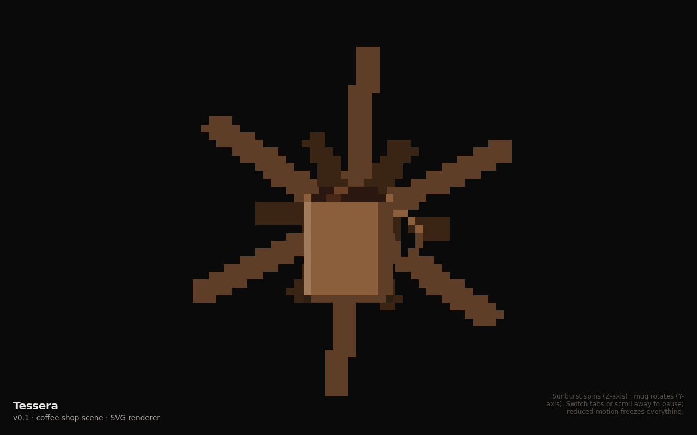
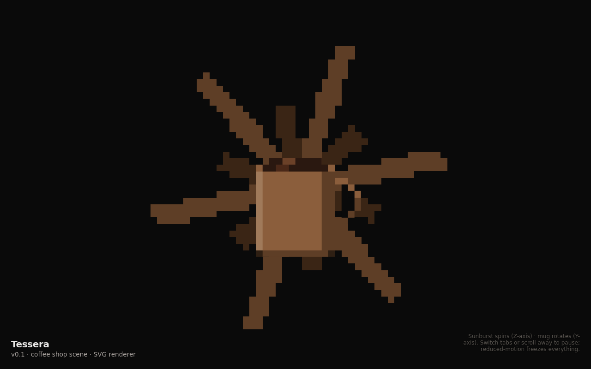

# ADR 0014: `vector` shape kind with per-frame rasterization

## Status

Accepted — 2026-04-29

## Visual evidence

**Before** — `voxel-sprite` shape with CSS `transform: rotate(angle)` on the entity group. Cardinal rays render cleanly; diagonal rays stair-step into jagged "spider-web" lines because the cells themselves are tilted off the grid:




**After** — `vector` shape rasterized to axis-aligned cells per frame. Every ray is a consistent 3-cell-wide bar at every rotation angle:





Captured at matched elapsed times (before: `feat/v0.2-vector-shape-rasterizer~`; after: this branch) so the rotation angles correspond.

## Context

The SVG renderer applies CSS `transform: rotate(angle)` to an animated entity's `<g>`. Every child `<rect>` rotates with the group — at non-cardinal angles, individual cells render as tilted parallelograms instead of axis-aligned squares. The pixel art aesthetic depends on cells being axis-aligned; tilting them produces stair-stepped, blob-shaped output that reads as "spiderweb" or "broken pixel ladders" rather than as coherent shapes.

This is fine for small Y-axis oscillation (the MotionPitch mug case — the tilt is the foreshortening), but it's wrong for in-plane (Z-axis) spin. The closed-without-merging PR #8 attempted to compensate with palette tweaks, dithering, thicker cells, and softer transitions. None of it fixed the underlying issue: *the cells themselves are rotating off the grid.*

The fix is the same trick arcade games used for sprite rotation — separate **shape definition** (continuous, mathematical) from **pixel rendering** (axis-aligned cells, rasterized per frame).

## Decision

Add a new `EntityShape` variant — `kind: "vector"` — alongside the existing `voxel-sprite`. Vector shapes are described as a list of `VectorSegment`s (currently just lines, with `from`, `to`, `thickness`, `fill`). The renderer:

1. Computes the current rotation angle from the entity's animation (same `oscillate` / `spin` types as before).
2. Rotates each segment's endpoints in cell-space around the entity's pivot.
3. Rasterizes each rotated segment into a deduped cell map (Bresenham-ish line walk + perpendicular thickness band).
4. Replaces the entity `<g>`'s children with `<rect>`s at the cell positions.

The entity `<g>` carries only a translate transform — no CSS rotation. Pixels stay locked to the grid; the shape's *positions* rotate.

```ts
export type EntityShape =
  | { kind: "voxel-sprite"; cells: VoxelSpriteCell[]; pivot?: ... }
  | { kind: "vector"; segments: VectorSegment[]; pivot?: ... };

export type VectorSegment = {
  kind: "line";
  from: { x: number; y: number };
  to: { x: number; y: number };
  thickness: number;
  fill: string;
};
```

Both shape kinds use the same `Animation` types. The renderer dispatches on `EntityShape.kind` to pick the rendering strategy.

## Consequences

- **Pro:** Vector shapes rotate cleanly at every angle. The sunburst rays no longer stair-step; this fixes the demo problem the closed PR #8 couldn't solve through design alone.
- **Pro:** The mental model maps cleanly to how arcade games handle sprite rotation. Pixels are sacred; shapes are abstract.
- **Pro:** Future shape kinds (filled polygons, arcs, beziers) can be added under the same `vector` umbrella by extending `VectorSegment` as a discriminated union.
- **Pro:** Voxel-sprite shapes still exist unchanged — the existing v0.1 mug remains correct (Y-axis oscillation foreshortening *is* the foreshortening, intentional).
- **Con:** Per-frame DOM thrash. Each frame the entity's `<g>` children are cleared and rebuilt. At ~200 cells per ray entity this is fine on modern browsers, but at 10× scale it'd be a performance concern. Acceptable for v0.2; if it bites later, a keyed diff replaces the wholesale clear.
- **Con:** Vector shapes don't compose with the page-citizenship layer's frame-budget meter as cleanly as voxel-sprites — pause/resume work fine, but throttling to lower fps means more cells flicker per visible frame. Cosmetic, not functional. Future work.
- **Con:** Two rendering paths to maintain in the SVG renderer (and any future renderer tier). The dispatch is straightforward but the engineering cost is real.

## Alternatives considered

- **Stay on voxel-sprite + iterate on design.** The closed PR #8 explored this path through several palette/dither/thickness iterations. None resolved the root issue: cells tilting off the grid. Rejected — the user-visible problem is mathematical, not aesthetic.
- **Render the entire entity as one rotated SVG `<g>` and accept the tilted cells.** That's what the v0.1 codebase does. It's correct for Y-oscillation (the user *wants* the foreshortening) but wrong for Z-spin. We need both modes; voxel-sprite stays for the former, vector handles the latter.
- **Use SVG `transform="rotate(angle cx cy)"` on individual `<rect>` elements.** Same problem: the `<rect>` itself rotates. Doesn't solve anything.
- **Switch the renderer to Canvas2D and rasterize natively.** Bigger architectural change; loses SVG accessibility benefits; doesn't help the fundamental issue (you still need to decide whether to draw rotated rects or rasterize). Rejected as out of scope; the same primitive will land in the eventual Canvas2D and WebGL2 tiers.
- **Store segments as SVG `<line>` elements with stroke-width and CSS rotation.** Drops the voxel aesthetic — `<line>` renders as anti-aliased strokes, not pixel cells. Rejected; defeats the framework's purpose.
